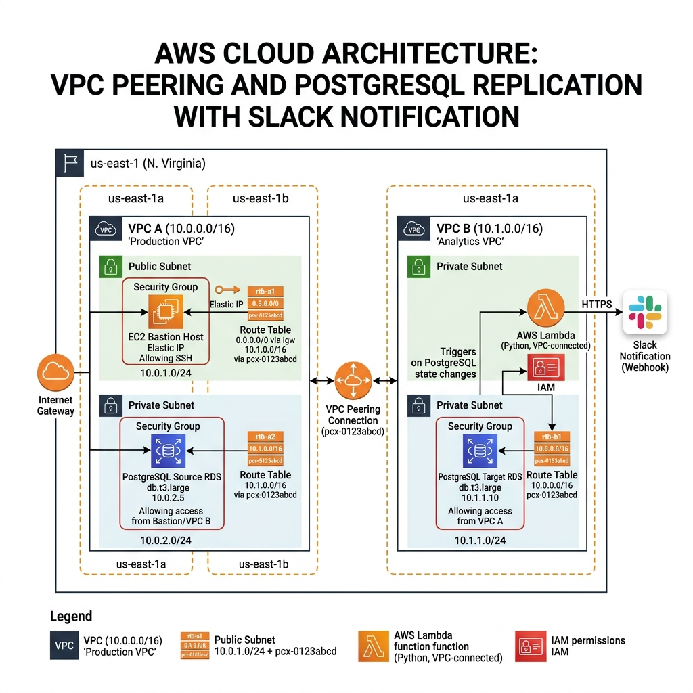

# AWS VPC Peering & Cross-VPC PostgreSQL Migration

<p align="center">
  
  
  
  
  
  
</p>

---

## 📌 Project Overview

This repository documents the end-to-end architecture and execution of a **Cross-VPC PostgreSQL Database Migration** on AWS. The migration transfers a PostgreSQL database between two completely isolated Virtual Private Clouds (VPCs) via a non-overlapping **AWS VPC Peering connection**, orchestrated securely through an **Amazon EC2 Bastion Host** without public database exposure.

### Key Highlights
- **Zero-Cost Strategy**: Built entirely within the AWS Free Tier limits (Standard Database Insights, Enhanced Monitoring disabled, Standard CloudWatch retention).
- **Network Isolation**: Source RDS (`VPC-A: 10.0.0.0/16`) and Target RDS (`VPC-B: 10.1.0.0/16`) reside in isolated private subnets with strict Security Groups.
- **Bastion Administration**: Single EC2 instance in `VPC-A Public Subnet` acts as the administrative jumpbox executing native `pg_dump` and `pg_restore`.
- **Automated Alerts**: Execution triggers a webhook notification sent to Slack upon successful data verification.

---

## 📐 System Architecture

<p align="center">
  
</p>

### Network Topology & Component Matrix

| Component | AWS Resource | Subnet Type | CIDR / IP Range | Security Focus |
| :--- | :--- | :--- | :--- | :--- |
| **VPC A** | `vpc-01a` | Custom VPC | `10.0.0.0/16` | Source VPC Boundary |
| **VPC B** | `vpc-02b` | Custom VPC | `10.1.0.0/16` | Target VPC Boundary |
| **Public Subnet A** | `subnet-pub-a` | Public | `10.0.1.0/24` | Attached to Internet Gateway |
| **Private Subnet A** | `subnet-priv-a` | Private | `10.0.2.0/24` | Isolated RDS Instance |
| **Private Subnet B** | `subnet-priv-b` | Private | `10.1.2.0/24` | Isolated RDS Target |
| **VPC Peering** | `pcx-peering-01` | Inter-VPC | `10.0.0.0/16 ↔ 10.1.0.0/16` | Active Routing State |
| **Bastion Host** | EC2 t2.micro / t3.micro | Public Subnet A | `10.0.1.50` | SSH Access + PG Client Tools |
| **Source Database** | RDS PostgreSQL (17/18) | Private Subnet A | `10.0.2.100` | Port 5432 Inbound from Bastion SG |
| **Target Database** | RDS PostgreSQL (17/18) | Private Subnet B | `10.1.2.100` | Port 5432 Inbound from VPC-A CIDR |

---

## 🔄 End-to-End Migration Workflow

```
[ Developer / Admin ]
        │
        │ SSH (Port 22)
        ▼
┌─────────────────────────────────────────────────────────────┐
│                       VPC A (10.0.0.0/16)                   │
│  ┌───────────────────────┐       ┌───────────────────────┐  │
│  │ Public Subnet (10.0.1)│       │Private Subnet (10.0.2)│  │
│  │  ┌─────────────────┐  │       │  ┌─────────────────┐  │  │
│  │  │  Bastion Host   │──┼───────┼─>│   Source RDS    │  │  │
│  │  │  (EC2 Instance) │  │pg_dump│  │  (PostgreSQL)   │  │  │
│  │  └────────┬────────┘  │       │  └─────────────────┘  │  │
│  └───────────┼───────────┘       └───────────────────────┘  │
└──────────────┼──────────────────────────────────────────────┘
               │
               │  VPC Peering Connection (pcx-peering-01)
               │  Traffic routed across private AWS backbone
               ▼
┌─────────────────────────────────────────────────────────────┐
│                       VPC B (10.1.0.0/16)                   │
│  ┌───────────────────────────────────────────────────────┐  │
│  │ Private Subnet (10.1.2.0/24)                          │  │
│  │  ┌─────────────────────────────────────────────────┐  │  │
│  │  │  Target RDS (PostgreSQL Instance)               │  │  │
│  │  │  pg_restore executed over VPC Peering           │  │  │
│  │  └────────────────────────┬────────────────────────┘  │  │
│  └───────────────────────────┼───────────────────────────┘  │
└──────────────────────────────┼──────────────────────────────┘
                               │
                               │ HTTPS (Slack Webhook)
                               ▼
                    [ Slack Channel Alert ]
```

---

## 🚀 Execution Steps

Detailed guides are located in the [`docs/`](docs/) directory:

1. **VPC & Subnet Setup**: Provision VPC-A (`10.0.0.0/16`) and VPC-B (`10.1.0.0/16`). See [`docs/architecture.md`](docs/architecture.md).
2. **VPC Peering Connection**: Request and accept peering between VPC-A and VPC-B. Update Route Tables to direct cross-CIDR traffic through `pcx-*`.
3. **Database Provisioning**: Deploy RDS PostgreSQL instances with Free Tier configurations (`db.t3.micro`/`db.t4g.micro`, 20GB storage, single-AZ).
4. **Bastion Host Launch**: Spin up an EC2 instance in VPC-A Public Subnet, attach Security Group allowing port 22 inbound.
5. **Database Migration**:
   - Dump source schema and data: `pg_dump -h <source-rds-endpoint> -U postgres -d company_db -F c -b -v -f company_db.dump`
   - Restore into target instance: `pg_restore -h <target-rds-endpoint> -U postgres -d company_db -v company_db.dump`
6. **Data Integrity Verification**: Run row count and schema validation scripts. See [`commands/sql-commands.md`](commands/sql-commands.md).
7. **Slack Notification**: Send automated bash payload to Slack incoming webhook.

---

## 🖼️ Documentation & Screenshots

The repository is structured to document each phase of the project:

- 📊 **Architecture Diagrams**: [`architecture/architecture-diagram.png`](architecture/architecture-diagram.png)
- 📸 **Console Screenshots**:
  - [`01-vpc-a.png`](screenshots/01-vpc-a.png): VPC A configuration & subnets.
  - [`03-vpc-peering-active.png`](screenshots/03-vpc-peering-active.png): VPC Peering Active status.
  - [`04-route-tables.png`](screenshots/04-route-tables.png): Route table entries for Peering.
  - [`05-bastion-host.png`](screenshots/05-bastion-host.png): EC2 Bastion details.
  - [`09-source-database.png`](screenshots/09-source-database.png): Source PostgreSQL connection.
  - [`10-pg-dump.png`](screenshots/10-pg-dump.png): Execution of `pg_dump`.
  - [`12-pg-restore.png`](screenshots/12-pg-restore.png): Execution of `pg_restore`.
  - [`13-migration-success.png`](screenshots/13-migration-success.png): Data verification output.
  - [`14-slack-notification.png`](screenshots/14-slack-notification.png): Slack confirmation message.

---

## 💡 Free Tier Cost Optimization & Avoidance Checklist

To ensure **$0.00** billing on AWS Free Tier:

- 🛑 **Database Insights**: Select **Database Insights - Standard** (7 days retention, $0). Do *not* select Advanced Insights.
- 🛑 **Performance Insights**: Choose free retention (7 days).
- 🛑 **Enhanced Monitoring**: Keep **disabled** (prevents CloudWatch Log stream ingestion charges).
- 🛑 **DevOps Guru**: Keep **turned off**.
- 🛑 **KMS Encryption**: Use standard default AWS managed key (`aws/rds`).
- 🛑 **Multi-AZ**: Keep disabled (Single AZ only).
- 🛑 **PostgreSQL Engine Version**: Use PostgreSQL 17 or 18. (Older versions like PG 10/11/12 require AWS RDS Extended Support which incurs hourly billing!).

> ⚠️ **Important Cleanup Notice**: Once your project testing is finished, terminate all RDS instances, EC2 instances, elastic IPs, and custom VPCs in order to avoid ongoing hourly resource charges. See [`docs/troubleshooting.md`](docs/troubleshooting.md#clean-up-guide).

---

## 🔒 Security Best Practices

- **Zero Public Access**: Both RDS instances have `Publicly Accessible = No`.
- **Least Privilege Inbound Rules**:
  - Source RDS Security Group allows port `5432` **only** from Bastion Security Group (`sg-bastion`).
  - Target RDS Security Group allows port `5432` **only** from VPC-A CIDR (`10.0.0.0/16`).
- **Encrypted Transfers**: SSL enabled for PostgreSQL network traffic (`sslmode=require`).

---

## 🛠️ Repository Directory Tree

```
aws-vpc-peering-postgresql-migration/
├── README.md
├── LICENSE
├── .gitignore
├── architecture/
│   ├── architecture-diagram.png
│   └── architecture.drawio
├── screenshots/
│   ├── 01-vpc-a.png
│   ├── 02-vpc-b.png
│   ├── 03-vpc-peering-active.png
│   ├── 04-route-tables.png
│   ├── 05-bastion-host.png
│   ├── 06-source-rds.png
│   ├── 07-target-rds.png
│   ├── 08-ssh-login.png
│   ├── 09-source-database.png
│   ├── 10-pg-dump.png
│   ├── 11-target-connection.png
│   ├── 12-pg-restore.png
│   ├── 13-migration-success.png
│   └── 14-slack-notification.png
├── docs/
│   ├── architecture.md
│   ├── implementation.md
│   ├── troubleshooting.md
│   ├── security.md
│   └── lessons-learned.md
└── commands/
    ├── migration-commands.md
    └── sql-commands.md
```

---

## 👤 Author

**Asbah Rehman**  
*DevOps Engineer | AWS Cloud Solutions | PostgreSQL Administration*

⭐ If you found this repository helpful, please consider giving it a star!
